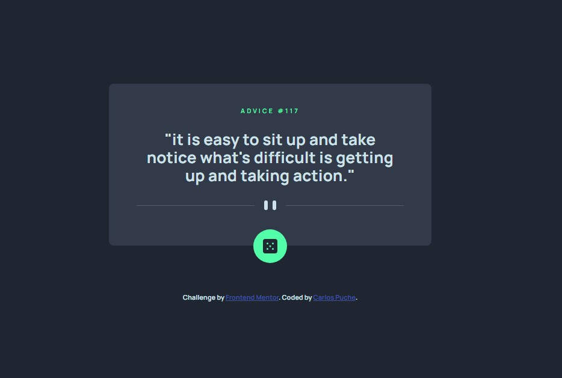

# Advice Generator App: Real-Time API Integration

This project is a **historical practice** centered on asynchronous JavaScript and dynamic UI updates. It marks my transition to interacting with live public APIs, focusing on handling external data streams and ensuring visual consistency regardless of content length.

---

## 🚀 Demo
[SEE DEMO HERE](https://cmp2007.github.io/advice-generator-app/)

### 🏆 Challenge Context
This project was developed as a solution to the [Advice generator app challenge on Frontend Mentor](https://www.frontendmentor.io/solutions/advicegeneratorapp-uZG6x1SVLS).

### Screenshot

---

## 📋 Evolution & Context Note
> ⚠️ **Note on my trajectory:** This repository represents the mastery of the "Request-Response" cycle. By connecting to a live API, I learned to manage network latency and asynchronous state changes. This project is a testament to my ability to build small, functional web tools that solve specific user interactions through real-time data.

## 📋 Technical Milestones of this Stage
In this specific phase of my training, I successfully achieved:

* **Live API Consumption:** Integration of the `Advice Slip API` using `fetch()`, including error handling via `.catch()` to ensure the application remains stable during network failures.

* **Dynamic Layout Recalculation:** Implementation of the `desplazarBoton()` function, which dynamically measures the `offsetHeight` of the advice text to precisely reposition the dice button, preventing UI overlap when advice length varies.
* **Responsive Asset Management:** Creation of a `checkWidth()` listener that swaps SVG divider patterns (`mobile` vs `desktop`) in real-time based on the `window.innerWidth` property.
* **CSS Glow & Interactive States:** Use of high-contrast `box-shadow` and `transition` effects to create a "neon glow" interaction on the trigger element, enhancing the tactile feel of the app.
* **Asynchronous UX:** Managing the visual "jump" of content by ensuring the UI updates only after the Promise is resolved, providing a seamless experience for the user.

## 🛠️ Technologies (at the time)
* **HTML5:** Semantic structure for single-card applications.
* **CSS3:** Advanced positioning, Grid layout, and custom interactive glows.
* **Vanilla JavaScript:** Asynchronous `fetch`, Promise chaining, and dynamic DOM measurement.

---
**Coded by [Carlos Miguel Puche](https://github.com/CMP2007)**
